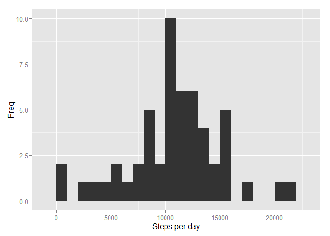
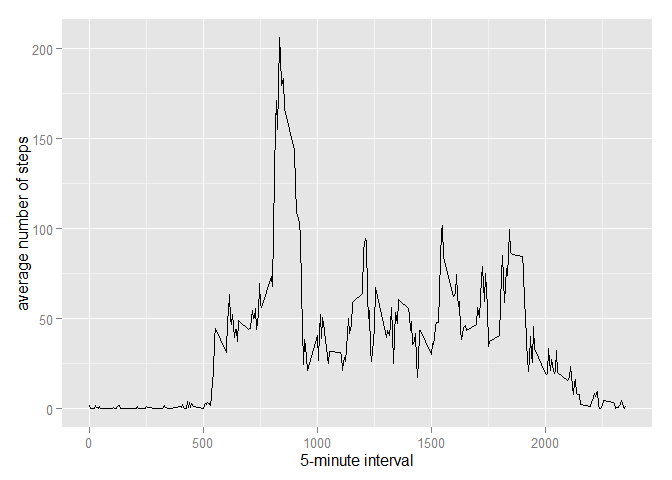
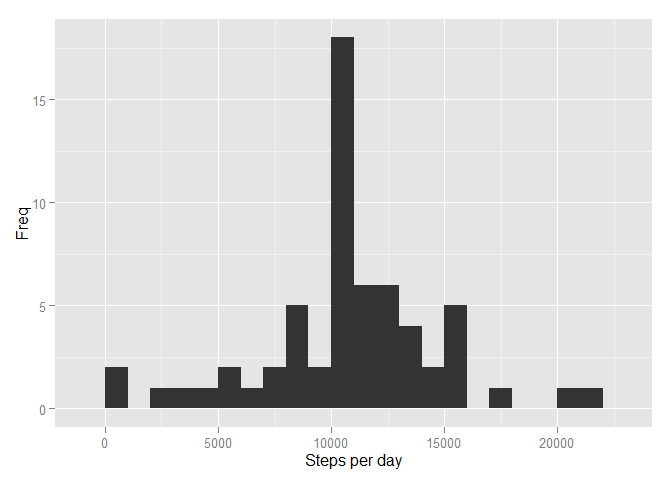
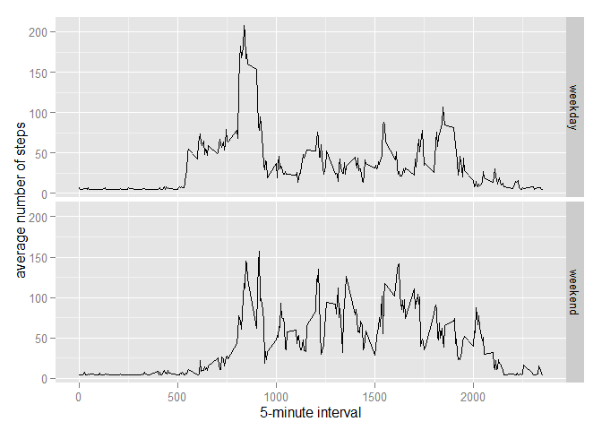

# Reproducible Research: Peer Assessment 1


## Loading and preprocessing the data


#### Loading the data (i.e. read.csv())

```r
unzip('activity.zip')
data <- read.csv('activity.csv')
```

## Total number of steps taken per day


#### Total number of steps taken per day

```r
totalNumberOfSteps <- sum(data[,1], na.rm = TRUE)
```
#### Histogram of the total number of steps taken each day

```r
dataForHist <- aggregate(data[,1], list(data[,2]), sum)
qplot(dataForHist$x, xlab = "Steps per day", ylab = "Freq", binwidth = 1000)
```

 

#### Mean and median of the total number of steps taken per day

```r
meanNumberOfSteps <- mean(data[,1], na.rm = TRUE)
medianNumberOfSteps <- median(data[,1], na.rm = TRUE)
```
## Average daily activity pattern

#### Plot of the 5-minute interval and the average number of steps taken

```r
averStepsPer5min <- aggregate(list(interval = data[,1]), list(steps = data[,3]), mean, na.rm = TRUE)
ggplot(data = averStepsPer5min, aes(steps, interval)) + 
  geom_line() +
  xlab("5-minute interval") + 
  ylab("average number of steps")
```

 

#### 5-minute interval with the maximum number of steps

```r
theMostMax <- which.max(averStepsPer5min$aversteps)
theMostSteps <- averStepsPer5min[theMostMax, 'interval']
```

## Imputing missing values

#### total number of missing values

```r
totalNumberOfMissingValues <- length(which(is.na(data$steps)))
```
#### Filling in all of the missing values in the dataset

```r
dataImputed <- data
dataImputed$steps <- impute(data$steps, fun=mean)
```
#### New dataset that is equal to the original dataset but with the missing data filled in

```r
dataImputedForHist <- aggregate(dataImputed[,1], list(dataImputed[,2]), sum)
```
#### Histogram of the total number of steps taken each day

```r
qplot(dataImputedForHist$x, xlab = "Steps per day", ylab = "Freq", binwidth = 1000)
```

 

#### Mean and median total number of steps taken per day

```r
meanNumberOfSteps <- mean(dataImputed[,1])
medianNumberOfSteps <- median(dataImputed[,1])
```
## There are differences in activity patterns between weekdays and weekends?

#### New factor variable in the dataset with two levels - "weekday" and "weekend"

```r
dataImputed$dateType <-  ifelse(as.POSIXlt(dataImputed$date)$wday %in% c(0,6), 'weekend', 'weekday')
```

#### Panel plot containing a time series plot (i.e. type = "l") of the 5-minute interval (x-axis) and the average number of steps taken, averaged across all weekday days or weekend days (y-axis)

```r
averagedDataImputed <- aggregate(steps ~ interval + dateType, data=dataImputed, mean)
ggplot(averagedDataImputed, aes(interval, steps)) + 
    geom_line() + 
    facet_grid(dateType ~ .) +
    xlab("5-minute interval") + 
    ylab("average number of steps")
```

 
